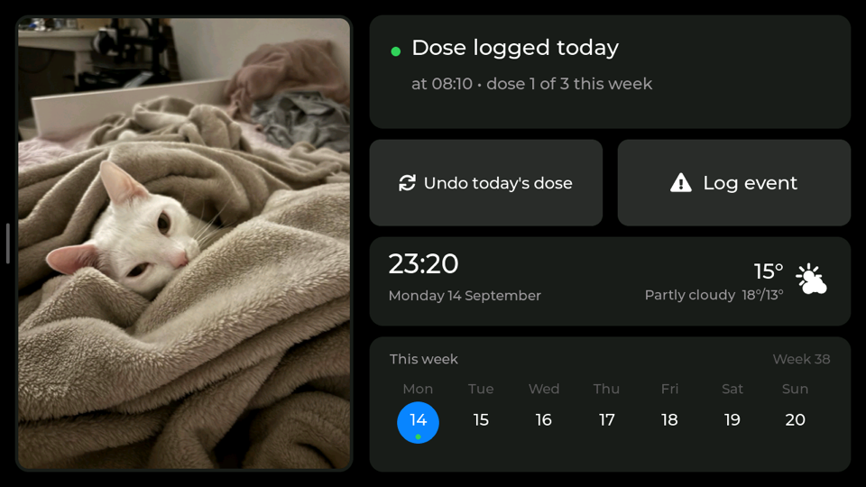
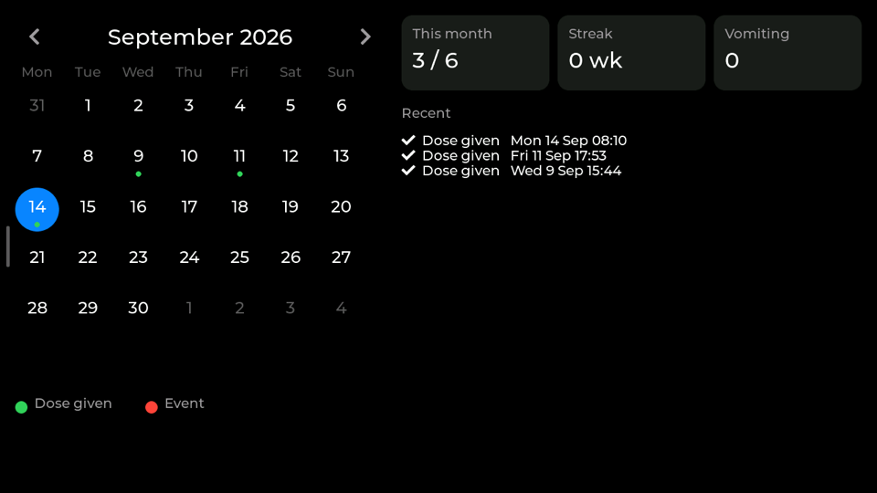
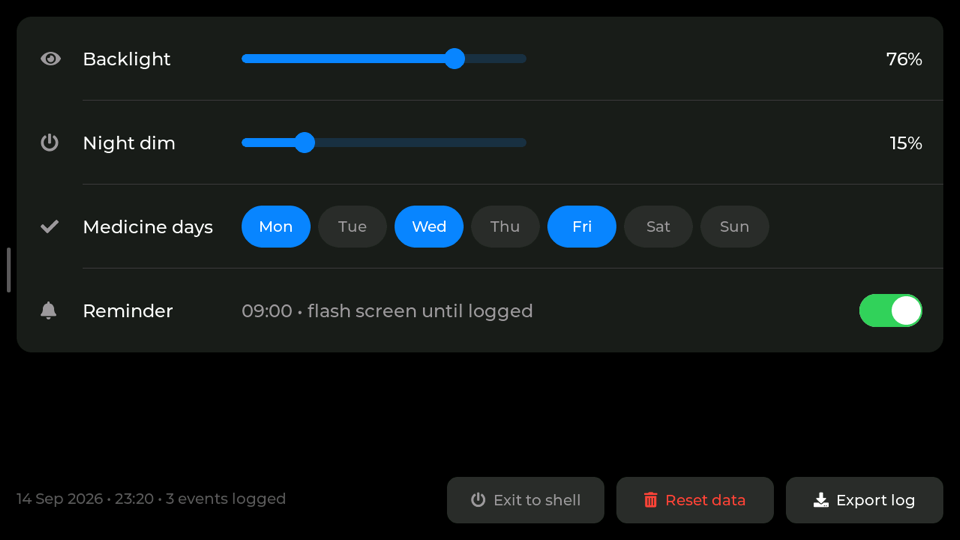

# cat-medicine-dashboard

A wall-mounted touchscreen that tracks a cat's medication, so the question
"did she already get it today?" has an answer you can see from across the
room.



Kim needs medicine three times a week. A note on the fridge kept getting
lost and two people kept not knowing whether the other had done it. This
is a Raspberry Pi and a touch panel that answers that, and shows a photo
of her while it waits.

LVGL 8.3, hand-written C, no UI builder. Runs as a systemd service,
straight to the framebuffer - no X, no Wayland, no browser.

## Screens

| Calendar | Settings |
|---|---|
|  |  |

- **Today** - the photo, whether today is a medicine day, the dose count
  for the week, a Mon..Sun strip, and buttons to log a dose or an event.
  Once a dose is logged the button becomes *Undo today's dose*: that is
  the only way to take back a mis-tap. *Log event* asks which kind,
  vomiting or food.
- **Calendar** - a month grid, green dot for a dose and red for vomiting,
  with month/streak/vomiting stats and a recent list. Food is logged and
  listed but deliberately not marked on the grid: it happens most days and
  would colour in every cell.
- **Settings** - backlight, night dim, which weekdays are medicine days, a
  reminder toggle, and buttons to export or reset the log.

Navigation is a left icon rail, hidden by default. Tap the grip on the
left edge to bring it in; tap the rail anywhere that is not an icon to put
it away. It also hides after 30 seconds, or as soon as you pick a screen.

Two extras earn their place on the home screen: the **weather** card says
when it will next rain rather than what it is doing now, and on weekday
mornings the week strip is replaced by the **next departures** from the
local bus stop.

## Hardware

- Raspberry Pi 3A+ (anything with a DSI connector and 512MB will do)
- [Waveshare 9" DSI touch panel (B)](https://www.waveshare.com/9-dsi-touch-b.htm),
  720x1280 - mounted landscape, so the UI is 1280x720 and LVGL rotates in
  software
- A **good** power supply. See [Power](#power) - this is not optional.

## Setup

Raspberry Pi OS Bookworm or later, with the panel already working under
`/dev/fb0`. No desktop environment needed.

**1. Clone and build.** LVGL is not vendored (125MB), so `setup.sh`
fetches it:

```sh
git clone https://github.com/georgebenett/cat-medicine-dashboard.git ~/cat-medicine-dashboard
cd ~/cat-medicine-dashboard
./setup.sh          # clones LVGL release/v8.3, builds. A few minutes on a 3A+.
```

**2. Add photos.** Any PNG in `photos/`, one shown per day. They must
cover the 490x666 window exactly - see [Photos](#photos) for why the size
matters and how to convert phone pictures:

```sh
mkdir -p photos
# ...copy PNGs in...
```

**3. Install the services.** `deploy.sh` installs every unit, enables them
at boot and restarts the dashboard:

```sh
./deploy.sh
```

> The unit files hardcode `/home/georges/cat-medicine-dashboard`. Edit the five
> `cat-*.service` / `lvglapp.service` files if your user or path differs.

That is enough for the dashboard itself. The rest is optional.

**4. Weather** (optional, no API key). Set your location in
`cat_cfg.txt`; it defaults to Malmö:

```
lat=55.6078
lon=12.9982
```

**5. Departures** (optional, southern Sweden). Needs a free
[Trafiklab](https://www.trafiklab.se/) ResRobot v2.1 key - Skånetrafiken
shut their own API down in 2021:

```sh
echo 'transit_key=YOUR_KEY' >> cat_cfg.txt
./transit.py --lookup "Malmo Varnhem"        # find the stop ids
./transit.py --lookup "Lund Scheeleparken"
```

then add `transit_from=` and `transit_to=` with those ids.

**6. Off-device backup** (recommended). `cat_log.csv` is the only
irreplaceable thing here and it lives on an SD card. `backup.sh` copies it
into a clone of a private repo and pushes hourly:

```sh
git clone git@github.com:YOU/cat-log-backup.git ~/cat_backup
./backup.sh                                  # check it works
```

It commits only when the log actually changed, and a wifi drop is not an
error: the commit is on disk and the next run pushes it. `$CAT_BACKUP_REPO`
overrides the clone location. To restore an older state - say a bad
shutdown truncated the file:

```sh
cd ~/cat_backup && git log --oneline         # every backup is a commit
git checkout <commit> -- cat_log.csv
cp cat_log.csv ~/cat-medicine-dashboard/ && sudo systemctl restart lvglapp
```

## Configuration

`cat_cfg.txt` sits next to the binary. Everything in it is also settable
from the Settings screen except where noted:

```
days=42                medicine-day bitmask, bit0=Sunday. Default Mon/Wed/Fri
name=Kim
backlight=50           remembered brightness, restored at startup
quiet_from=23          night dim starts (hour)
quiet_to=5             night dim ends (hour)
dim_pct=15             night brightness, never above the awake one
reminder=1             flash the status card when a dose is overdue
reminder_h=9           reminder time - no picker in the UI
reminder_m=0
lat=55.6078            weather location
lon=12.9982
rain_pct=40            chance that counts as "take a coat"
transit_key=           Trafiklab key - not in the UI
transit_from=          stop ids
transit_to=
transit_lead=8         minutes you need to reach the stop
transit_start=08:00    departure board window
transit_end=09:30
```

`cat_log.csv` is the record, one event per line, append-only:

```
2026-09-14T08:10,med
2026-09-11T17:53,med
2026-09-09T18:06,vomit
```

Both files are plain text, readable and editable without this app, and
gitignored - they are device data, not source. Paths are overridable with
`CAT_LOG`, `CAT_CFG`, `CAT_IMG`.

*Reset data* renames the log to `archive_YYYYMMDD-HHMM.csv` rather than
deleting it, and `backup.sh` pushes those too: it sits next to *Exit to
shell*, and a confirm dialog should not be the only thing between a
mis-tap and months of history.

*Exit to shell* quits and puts the console back on the panel. The unit is
`Restart=on-failure`, so a clean exit stays stopped. Start it again with
`sudo systemctl start lvglapp`.

## Photos

One photo a day, changing at midnight. Tapping it advances early; the tap
holds until the next midnight. Which photo belongs to which day comes from
the date, not a random draw, so a reboot shows the same picture as the rest
of the day. The running order is shuffled once with a fixed seed rather
than left alphabetical, so a month does not land entirely inside one import
batch.

Photos load at runtime through LVGL's POSIX filesystem driver, *not*
compiled in as C arrays, so changing them needs no rebuild.

**Export to exactly cover the 490x666 window, with no safety margin.**
LVGL only takes its fast blit path when the zoom works out to exactly 256;
a 3% margin put 34 of 47 photos on 249, which runs the per-pixel transform
and tripled the cost of a full home-screen redraw (43ms -> 101ms).
`photo_show()` warns if a photo would upscale.

**Apply EXIF orientation first.** Phone photos are a landscape raster plus
an orientation tag, and `sips -Z` ignores the tag, so pictures arrive
rotated. It is not one fixed rotation either: of 14 photos here, 12 were
orientation 6 (90° clockwise) and 2 were orientation 8 (90° anticlockwise).
Read the tag per photo - a blanket rotation leaves some upside down.

Each photo decodes to 4 bytes per pixel and must fit `LV_MEM_SIZE` (8MB),
so anything over 6MB decoded is skipped with a line on stdout. A stock
phone photo is ~4000x3000, which is 48MB.

`pill.png` (the dose button icon) and `wx_*.png` (weather) load the same
way - LVGL's built-in symbol font has no pill or cloud glyph.

## How it works

Everything that touches the network is a **systemd timer that writes a
file**; the UI only ever reads those files. Nothing blocks the LVGL loop,
because a blocking HTTP call inside it freezes the panel for as long as the
network takes - and this Pi's network is the least reliable part of it.

| Timer | Interval | Writes |
|---|---|---|
| `cat-weather` | 20 min | `weather.txt` |
| `cat-transit` | 5 min, inside the window only | `transit.txt` |
| `cat-backup` | hourly | pushes `cat_log.csv` |
| `cat-wifi` | 2 min | bounces a wedged link |
| `cat-dim` | at boot | holds the panel dark |

Stale data is handled rather than hidden: weather older than three hours is
greyed out, and a departure board older than 15 minutes is replaced by the
week strip. A stale departure board is worse than none.

### Backlight

Held dark from the first line of `main()` and by `cat-dim.service`, which
runs before the console appears. Once `ui_init()` has built the UI, `main()`
fades up to the remembered brightness over ~1.2s, writing sysfs only when
the value actually changes.

Dimming is by the clock, not by idleness. An idle timer used to put the
panel to sleep in the middle of the day, which is exactly when an unlogged
dose most needs to catch someone's eye. It never dims *up*: if the slider
sits below `dim_pct`, that lower value is used.

### Power

**Use a good supply.** The Pi this runs on logs `Undervoltage detected!`
and `vcgencmd get_throttled` returns `0x50000` - under-voltage and
throttling have both occurred. It rebooted on its own twice in one evening.

That is the cause of most apparent "wifi drops": the machine is
power-cycling, not losing its association. `cat-wifi.timer` is a safety net
for a wedged link, not a fix for this. Unexpected reboots also corrupt SD
cards, which is why the log is backed up off the device - and why one
brownout truncated a systemd unit to zero bytes, which systemd reads as
*masked*, so the service silently never ran.

## Gotchas

Things that cost real debugging time, kept here so they cost it once:

- **Software rotation only.** `/dev/fb0` is 720x1280; the kernel cmdline
  `rotate=90` rotates console text, not the framebuffer. LVGL gets the
  native size with `LV_DISP_ROT_90 + sw_rotate` and reports 1280x720.
- **Never set `full_refresh` with `sw_rotate`** - `lv_refr.c` bails before
  `flush_cb` and nothing reaches the panel.
- **Raise `LV_DISP_ROT_MAX_BUF` with `DRAW_LINES`.** LVGL rotates in chunks
  and flushes after each; at the 10KB default and 1280px wide that is 4
  rows per pass, so a full redraw was 180 rotate-and-flush cycles - visible
  as a wipe travelling down the screen. Now 3.
- **Touch is found by name**, not `/dev/input/eventN` - the index moves
  across reboots. Ranges come from `EVIOCGABS`; the Goodix reports 0-4095,
  not pixels.
- **Touch coords go to LVGL unrotated** - `indev_pointer_proc()` already
  applies `disp_drv.rotated`.
- **A fast tap can be swallowed.** `touch_read()` drains every pending
  evdev event but LVGL polls every 30ms, so a tap whose press and release
  land in one window reports only "released". `src/touch.h` latches the
  press and defers the release.
- **`lv_obj_create` sets `CLICKABLE` by default** and
  `lv_obj_remove_style_all()` does not clear flags - a decorative child
  centred over a button silently eats its taps.
- **`LV_OBJ_FLAG_PRESS_LOCK`** or LVGL re-searches the object under the
  finger every poll, and a press that drifts clicks whatever it ends over.
- **Gestures do not fire on this touch driver.** Instrumenting showed the
  gesture callbacks never run while click callbacks always do, with a real
  finger and with synthetic evdev input alike. Clearing `SCROLLABLE` off
  the layers made no difference. The rail is driven by taps.
- **Only ASCII, U+00B0 and U+2022 exist in the built-in fonts**, plus the
  `LV_SYMBOL_*` glyphs. A middle dot (U+00B7) renders as a tofu box. Check
  `unicode_list_1` in `lvgl/src/font/lv_font_montserrat_*.c` first.
- **Objects depend on `lv_conf.h`** in the Makefile - it reshapes LVGL's
  structs, and stale `.o` files link fine and then misbehave.
- **Do not include `lvgl.mk`.** Its first two lines pull in `demos/` and
  `examples/` - 234 object files of music player and benchmark linked into
  your binary. Include the seven `src/*.mk` files instead.

## Development

```sh
make            # build
make test       # date/schedule maths and the touch latch, no panel needed
./deploy.sh     # pull, rebuild, reinstall units, restart
./run.sh        # foreground, Ctrl+C to quit - stops the service and unbinds fbcon
```

Two things paint into `/dev/fb0` besides the app: the service itself, and
**fbcon**, the kernel console - `console=tty1` is why kernel messages land
across the design. `lvglapp.service` unbinds it on start and rebinds it on
stop.

Debug knobs, no rebuild needed:

| Variable | Effect |
|---|---|
| `CAT_SCREEN=0\|1\|2` | open on Today / Calendar / Settings |
| `CAT_POPUP=1` | open the Log event sheet |
| `CAT_TOAST="text"` | pin a toast up |
| `TOUCH_DEBUG=1` | touch coordinates to stderr |
| `TOUCH_CURSOR=1` | draw a red dot at the pointer |
| `TOUCH_SWAP` / `TOUCH_INVX` / `TOUCH_INVY` | calibration for a differently-mounted panel |

To see what is actually on the panel without being in the room, read the
framebuffer directly - this is how every screenshot here was taken:

```sh
ssh pi 'head -c 1843200 /dev/fb0' > fb.raw    # 720*1280*2 bytes, RGB565
# ...convert, then rotate 90° for landscape
```

## Licence

MIT. The photos of Kim are not included.
